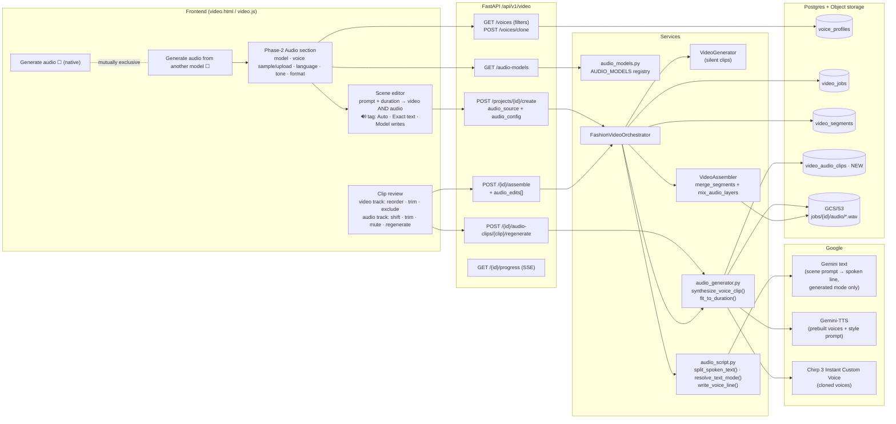
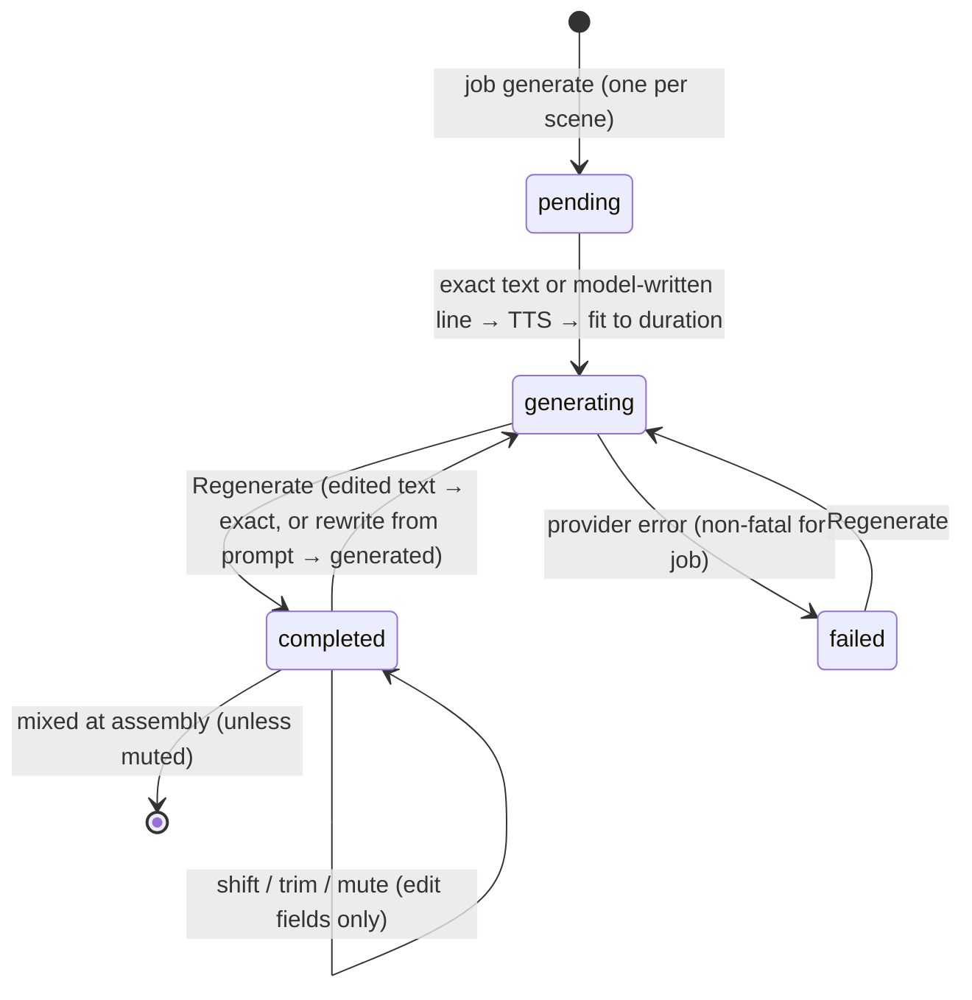
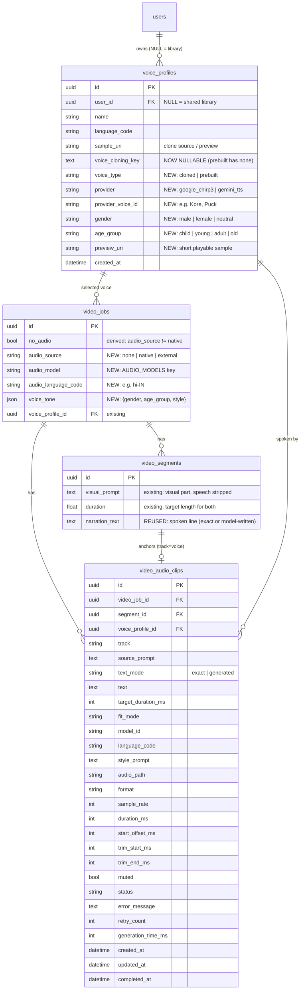

# Architecture: Generate audio from another model

## 1. System architecture

The frontend adds a second, mutually exclusive audio option and a phase-2 Audio section. There is no separate audio prompt: each scene's video prompt and duration drive both its video clip and its audio clip. Words in quotes or after `VO:` are spoken exactly; otherwise the model writes the line from the description. The API gains endpoints for audio models, voice filters, clip regeneration and audio edits at assembly. The orchestrator generates silent video clips and same-length voice clips side by side, and the assembler mixes the placed voice clips into the final MP4.



---

## 2. End-to-end sequence

From ticking the checkbox to the final MP4. Voice clips need only the scene prompt and duration, so they are generated **in parallel** with the silent video clips (Phase 4 and Phase 4b), at the same length as their video clips, and are ready when the job pauses at `clips_ready` for review.

```mermaid
sequenceDiagram
  actor U as User
  participant FE as video.js
  participant API as routes/video.py
  participant OR as Orchestrator
  participant VG as VideoGenerator
  participant AG as audio_generator
  participant G as Google TTS
  participant AS as Assembler
  participant DB as Postgres

  U->>FE: tick "Generate audio from another model"
  FE->>API: GET /audio-models, GET /voices?language=&gender=&age_group=
  U->>FE: pick model, voice (library / upload), language, tone; write scene prompts + durations as usual
  FE->>API: POST /projects/{id}/create {audio_source:"external", audio_config, scenes[]}
  API->>API: validate (model exists, voice accessible, not native)
  API->>DB: video_jobs (no_audio=true, audio_*), structured_input.scenes
  FE->>API: POST /{id}/generate
  API->>OR: BackgroundTasks.run(job_id)
  OR->>OR: split_spoken_text(prompt) → visual part + exact text
  OR->>DB: segments (visual part as prompt, duration, narration_text = exact text)
  par Phase 4 — video clips (silent)
    OR->>VG: generate each clip from the visual part only (no_audio=true)
  and Phase 4b — voice clips (same scene, no video dependency)
    OR->>DB: insert video_audio_clips (pending, source_prompt, target_duration_ms, text_mode)
    alt text_mode = exact
      OR->>OR: use the quoted / VO text as written
    else text_mode = generated
      OR->>G: write_voice_line(scene prompt, duration) via Gemini text
      G-->>OR: spoken line (fits word budget)
    end
    OR->>AG: synthesize_voice_clip() per scene
    AG->>G: Gemini-TTS / Chirp 3 clone
    G-->>AG: audio bytes (model-native format)
    AG->>AG: fit_to_duration(target_duration_ms, text_mode)
    AG->>DB: clip.text, audio_path, format, duration_ms, fit_mode, status=completed
  end
  OR-->>FE: SSE clips_ready (job pauses, auto_approve=false)
  FE->>API: GET /{id} (segments + audio_clips)
  U->>FE: video track: reorder/trim/exclude · audio track: shift/trim/mute/regenerate
  FE->>API: POST /{id}/audio-clips/{clip}/regenerate {text | rewrite:true}
  API->>AG: background re-synthesize, SSE update
  U->>FE: Approve & Assemble
  FE->>API: POST /{id}/assemble {segment_order, trims, audio_edits[]}
  API->>DB: persist audio_edits onto clip rows
  API->>OR: assemble_with_order
  OR->>AS: merge_segments (silent) → mix_audio_layers(placed voice clips)
  AS-->>OR: output.mp4 (single video, one audio track)
  OR-->>FE: SSE completed
```

---

## 3. Audio clip lifecycle

States of one `video_audio_clips` row. A failure is non-fatal for the job and can be retried. Shift, trim and mute only change edit fields and never re-synthesize; regenerate does.



---

## 4. ER diagram (new and changed only)

`video_audio_clips` is new. `voice_profiles` and `video_jobs` gain columns. `video_segments.narration_text` is reused to hold the scene's spoken line, whether exact or model-written. Column details are in [data_model.md](data_model.md).


