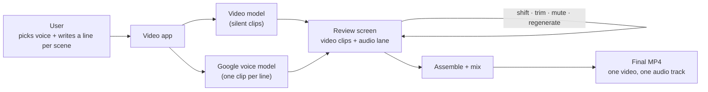
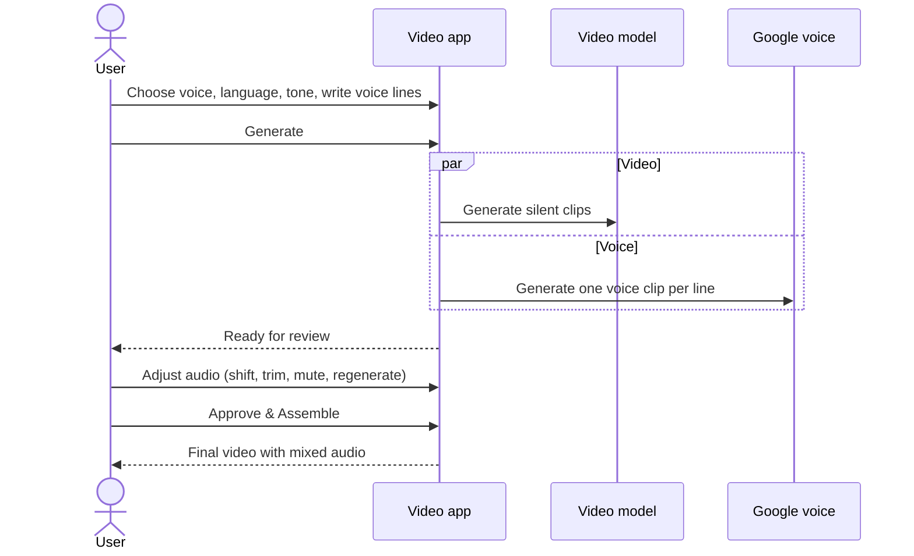

# Generate audio from another model

Engineering detail lives in the companion documents:
- [architecture.md](architecture.md): all diagrams
- [data_model.md](data_model.md): table definitions and migration
- [technical_plan.md](technical_plan.md): implementation plan for engineering review

---

## 1. The problem

The best video model for a job often has no native audio. Today only Seedance and FLUX 3 produce sound. Veo, Omni, Grok, Happy Horse and Kling either fake it through the prompt or produce none at all.

So a user who picks the best-looking video model has to give up audio.

## 2. The proposed solution

Split picture and sound, then join them at the end:

1. Generate **silent** video clips with whichever video model gives the best picture.
2. Generate the **voice separately** with a Google voice model: Gemini TTS for ready-made voices, or Google voice cloning for the user's own voice.
3. Show the voice as an **editable audio track** at the review step, next to the video clips.
4. **Mix** everything into one final MP4.

The user writes **one voice line per scene**. Each line becomes its own audio clip, tied to its scene, so it stays in sync when scenes are reordered or trimmed.

## 3. What the user sees

1. In the video form, the user ticks **"Generate audio from another model"**. This option and the existing "Generate audio" (native) option are mutually exclusive: ticking one disables the other.
2. An **Audio** section appears. The user picks:
   - the voice model
   - the language
   - the tone (gender, age, speaking style)
   - a voice from the library (each has a ▶ preview), or uploads their own voice sample to clone
   - the output format is shown for information only
3. In the scene editor, each scene gets a **Voice line** box with a hint showing roughly how long the speech will be compared with the scene.
4. The user clicks **Generate**. Video clips and voice clips are produced at the same time.
5. At review, an **audio lane** sits under the video clips. For each voice clip the user can:
   - **shift** it earlier or later
   - **trim** the start or end
   - **mute** it
   - **regenerate** it with edited text
6. The user clicks **Approve & Assemble** and receives one video with one audio track.

## 4. How it works

The full technical diagrams are in [architecture.md](architecture.md).

## 5. Data changes at a glance

| Table | Change | Why |
|---|---|---|
| **Audio clips** (new) | One row per generated voice clip: its text, voice, status, and the user's edits (shift, trim, mute) | Each clip has its own lifecycle and can be regenerated on its own |
| **Voice profiles** (changed) | Now holds both ready-made Google voices and cloned voices, tagged with gender and age, with a short preview sample | Powers the voice picker and its filters |
| **Video jobs** (changed) | Records where audio comes from (none, native or external), plus the chosen model, language and tone | One clear setting replaces the old single narration script |

Which audio models are available is kept in code, not in a table, the same way video models are today.

Full definitions are in [data_model.md](data_model.md).

## 6. Scope

**In scope**
- Prompted video jobs
- Google voices only: Gemini TTS ready-made voices and Google voice cloning
- One voice line per scene
- Review edits: shift, trim, mute, regenerate
- A shared voice library with previews, plus user-uploaded cloned voices

**Out of scope for this version**
- Batch video jobs (they stay without external audio)
- Other voice providers
- Sound effects and music lanes (the design leaves room for them later)
- A fully synced live preview at review time; the assembled video is the real preview

## 7. Risks and open questions

| Item | Detail | How we handle it |
|---|---|---|
| **Does Gemini TTS support cloned voices?** | Not yet confirmed | If yes, one model covers everything. If not, cloned voices use the existing Google cloning path and ready-made voices use Gemini TTS. The UI adapts to what each model supports, so the design works either way. |
| **Replacing phase-1 narration** | Phase 1 added one global narration track over the whole video. It is not live on main yet. | This design **replaces** it with per-scene lines. The voice library and cloning work from phase 1 are kept and extended. *Needs sign-off.* |
| **Voice lines too long for a scene** | Speech may run past its scene | The user sees a length hint while typing and a warning on submit, and can shift or trim at review |
| **A voice clip fails to generate** | Provider error | It does not fail the whole job. That clip is marked failed and the user can regenerate it. |
| **Audio mixing fails** | Error at the final step | The user still gets the silent video, and the error is logged |

## 8. Rollout phases

1. **Foundation:** bring this work up to date with the latest main branch, and add the new data tables.
2. **Voice generation:** connect Gemini TTS alongside the existing voice cloning.
3. **API:** new options for creating jobs, regenerating a voice clip, and saving audio edits.
4. **Pipeline:** generate voice clips in parallel with video, then place and mix them at assembly.
5. **User interface:** the new checkbox, the Audio section, voice lines per scene, and the audio lane at review.
6. **End-to-end testing:** ready-made and cloned voices, reorder and trim sync, and storage.

Implementation starts only after this design is approved.
