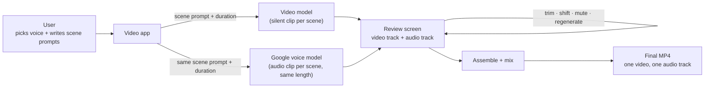
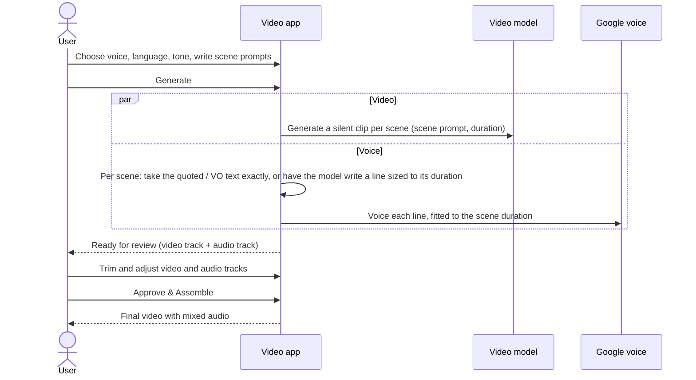

# Generate audio from another model

Engineering detail lives in the companion documents:
- [architecture.md](architecture.md): all diagrams
- [data_model.md](data_model.md): table definitions and migration
- [technical_plan.md](technical_plan.md): implementation plan for engineering review

---

## 1. The problem

The best video model for a job often has no native audio. Today only Seedance,Veo,Omni and FLUX 3 produce sound. Grok, Happy Horse and Kling either fake it through the prompt or produce none at all.

So a user who picks the best-looking video model has to give up audio.

## 2. The proposed solution

Split picture and sound, then join them at the end:

1. Generate **silent** video clips with whichever video model gives the best picture.
2. Generate the **voice separately** with a Google voice model: Gemini TTS for ready-made voices, or Google voice cloning for the user's own voice.
3. Show the video track and the audio track side by side at the review step, where **both can be trimmed and adjusted**.
4. **Mix** them into one final MP4.

**The audio prompt comes from the video form.** The user does not write anything extra for audio. Each scene's video prompt (with its mood and setting) and its duration are used for both:
- the **video clip**: made from the scene prompt the same way the app already does it, with no change
- the **audio clip**: voiced to the same length as the scene

So each scene produces one video clip and one audio clip with the **same length and the same context**. Each audio clip is tied to its scene, so it stays in sync when scenes are reordered or trimmed.

**Two ways to get the spoken words, chosen by how the scene is described:**

| The scene description… | What is spoken | Example |
|---|---|---|
| contains words in quotes, or a line starting with `VO:` | **Exactly those words**, as written | `Model walks toward camera in a red linen dress. VO: "Summer, made in linen."` → speaks *"Summer, made in linen."* |
| has no quoted or `VO:` text | **A line the model writes** from the description, fitted to the scene length | `Model walks toward camera in a red linen dress, golden hour` → model writes something like *"Light, breezy linen for long summer evenings."* |

Scenes in one video can mix both: one scene can have exact words and the next can let the model write. If the automatic choice is wrong for a scene, the user can switch it by hand (see below).

## 3. What the user sees

1. In the video form, the user ticks **"Generate audio from another model"**. This option and the existing "Generate audio" option are mutually exclusive: ticking one disables the other.
2. An **Audio** section appears. The user picks:
   - the voice model
   - the language
   - the tone (gender, age, speaking style)
   - a voice from the library (each has a ▶ preview), or uploads their own voice sample to clone
   - the output format is shown for information only (mp3,wav etc.)
3. The scene editor works as today: the user writes the scene description and sets the duration. To have exact words spoken, the user puts them in quotes or after `VO:` in the same description. A small 🔊 tag on each scene shows what will happen:
   - **"Speaks your text · 3s of 5s"** when exact words were found, with a warning if they are too long for the scene
   - **"Model writes the line"** when none were found
   - Clicking the tag switches the scene between **Auto** (the default), **Exact text** and **Model writes**.
4. The user clicks **Generate**. For each scene, the video clip and the audio clip are produced at the same time, both at the scene's duration.
5. At review, the user sees two tracks on one timeline: the **video track** (the generated clips) and the **audio track** under it (the generated voice clips), and can play each clip.
   - **Video track:** reorder, trim and exclude clips, as today.
   - **Audio track:** for each voice clip the user can
     - **shift** it earlier or later
     - **trim** the start or end
     - **mute** it
     - see the spoken text and whether it was exact or written by the model
     - **regenerate** it, either by editing the spoken text (it is then spoken exactly) or by asking the model to write it again from the scene description
6. The user clicks **Approve & Assemble**. The video and audio tracks are mixed into **one MP4 file** with one audio track.

## 4. How it works

The full technical diagrams are in [architecture.md](architecture.md).

## 5. Data changes at a glance

| Table | Change | Why |
|---|---|---|
| **Audio clips** (new) | One row per scene's voice clip: the scene prompt it came from, the spoken text, whether that text was exact or written by the model, its target length, voice, status, and the user's edits (shift, trim, mute) | Each clip has its own lifecycle and can be regenerated on its own |
| **Voice profiles** (changed) | Now holds both ready-made Google voices and cloned voices, tagged with gender and age, with a short preview sample | Powers the voice picker and its filters |
| **Video jobs** (changed) | Records where audio comes from (none, native or external), plus the chosen model, language and tone | One clear setting replaces the old single narration script |

Scenes get one optional setting, the audio mode (Auto, Exact text or Model writes), which is only stored when the user overrides Auto. Otherwise the audio reuses each scene's existing prompt and duration.

Which audio models are available is kept in code, not in a table, the same way video models are today.

Full definitions are in [data_model.md](data_model.md).

## 6. Scope

**In scope**
- Prompted video jobs
- Google voices only: Gemini TTS ready-made voices and Google voice cloning
- One audio clip per scene, made from the scene's video prompt and matched to its duration
- Both ways of getting the words: exact text (quotes or `VO:`) and model-written lines, mixed freely across scenes
- Review: video track (reorder, trim, exclude) and audio track (shift, trim, mute, regenerate)
- Mixing both tracks into one MP4
- A shared voice library with previews, plus user-uploaded cloned voices

**Out of scope for this version**
- Batch video jobs (they stay without external audio)
- Other voice providers
- Sound effects and music lanes (the design leaves room for them later)
- A fully synced live preview at review time; the assembled video is the real preview

## 7. Risks and open questions

| Item | Detail | How we handle it |
|---|---|---|
| **Does Gemini TTS support cloned voices?** | Not yet confirmed | If yes, one model covers everything. If not, cloned voices use the existing Google cloning path and ready-made voices use Gemini TTS. The UI adapts to what each model supports, so the design works either way. |
| **Replacing phase-1 narration** | Phase 1 added one global narration track over the whole video. It is not live on main yet. | This design **replaces** it with per-scene audio made from the scene prompts. The voice library and cloning work from phase 1 are kept and extended. *Needs sign-off.* |
| **Exact or model-written: picking the wrong one** | The automatic choice relies on quotes or `VO:` in the description | The 🔊 tag shows the choice before Generate, and the user can switch it per scene. At review, the spoken text is visible and can be edited. |
| **Exact text too long for its scene** | The user's words are never changed, so they cannot be shortened | The tag warns while typing ("~7s of speech, scene is 5s"). After voicing, the audio is sped up a little (up to 15%). If it is still longer, it is **kept whole** and marked "runs over" at review, where the user can lengthen the scene, shift the audio, trim it, or shorten the text. |
| **Model-written line does not match the scene length** | Speech speed varies by voice and language | The line is written to a word budget based on the scene duration. After voicing, short audio is padded with silence and slightly long audio is sped up a little (up to 15%). If it is still too long, it is rewritten shorter once, then trimmed. |
| **Spoken words drawn on screen** | Some video models render quoted text as on-screen captions or try to lip-sync it | The quoted / `VO:` part is removed from the prompt sent to the video model; the video model gets only the visual description. |
| **A voice clip fails to generate** | Provider error | It does not fail the whole job. That clip is marked failed and the user can regenerate it. |
| **Audio mixing fails** | Error at the final step | The user still gets the silent video, and the error is logged |

## 8. Rollout phases

1. **Foundation:** bring this work up to date with the latest main branch, and add the new data tables.
2. **Voice generation:** connect Gemini TTS alongside the existing voice cloning.
3. **API:** new options for creating jobs, regenerating a voice clip, and saving audio edits.
4. **Pipeline:** for each scene, take the exact text or have the model write the line, voice it and fit it to the scene duration, in parallel with video; then place and mix the clips at assembly.
5. **User interface:** the new checkbox, the Audio section, the audio tag and mode switch on scenes, and the video and audio tracks at review.
6. **End-to-end testing:** ready-made and cloned voices, exact and model-written scenes in one video, audio length matching each scene, reorder and trim sync, and storage.

Implementation starts only after this design is approved.
